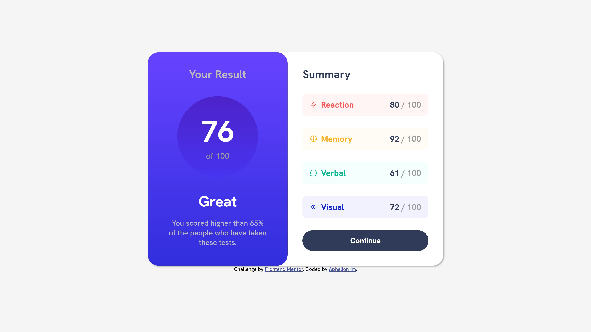

# Frontend Mentor - Results summary component solution

This is a solution to the [Results summary component challenge on Frontend Mentor](https://www.frontendmentor.io/challenges/results-summary-component-CE_K6s0maV). Frontend Mentor challenges help you improve your coding skills by building realistic projects.

## Table of contents

- [Overview](#overview)
  - [The challenge](#the-challenge)
  - [Screenshot](#screenshot)
  - [Links](#links)
- [My process](#my-process)
  - [Built with](#built-with)
  - [What I learned](#what-i-learned)
  - [Continued development](#continued-development)
  - [Useful resources](#useful-resources)
- [Author](#author)

## Overview

### The challenge

Users should be able to:

- View the optimal layout for the interface depending on their device's screen size
- See hover and focus states for all interactive elements on the page
- **Bonus**: Use the local JSON data to dynamically populate the content

### Screenshot

### Links

- Solution URL: [Add solution URL here](https://your-solution-url.com)
- Live Site URL: [Add live site URL here](https://your-live-site-url.com)

## My process

### Built with

- Semantic HTML5 markup
- Sass
- Flexbox
- Mobile-first workflow
- [ViteJS](https://vitejs.dev/)

### What I learned

* Learned that you can compile Sass with [ParcelJS](https://parceljs.org/).
* That you don't have to compile Sass when using ViteJS.
* Display: flex, ruins border-radius: 50%;
* How you can import a JSON file. With import and with Fetch API. See the article below in the "Useful resources" section.

### Continued development

I have currently no intentions to continue this project.

### Useful resources

- [CSS gradient](https://cssgradient.io) - This helped me to create the CSS gradients
- [CSS box shadow generator](https://cssgenerator.org/box-shadow-css-generator.html) - This helped me to generate shadows and corresponding CSS code.
- [How to Read a JSON File in JavaScript – Reading JSON in JS](https://www.freecodecamp.org/news/how-to-read-json-file-in-javascript/)

## Author

- Frontend Mentor - [@Aphelion-im](https://www.frontendmentor.io/profile/Aphelion-im)

